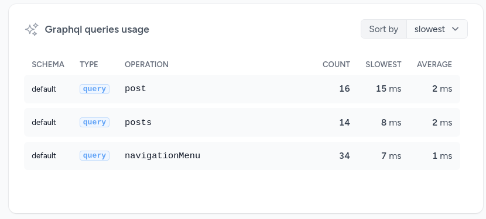

<p align="center"></p>

# GraphQL requests in Laravel Pulse

[](https://packagist.org/packages/quix-labs/laravel-pulse-graphql)
[](https://packagist.org/packages/quix-labs/laravel-pulse-graphql)

___
This package allow your to track all your GraphQL queries and mutations with rebing/graphql-laravel
___


## Installation

You can install the package via composer:

```bash
composer require quix-labs/laravel-pulse-graphql
```


## Register the recorder

Add the `GraphqlRecorder` inside `config/pulse.php`.

(If you don\'t have this file make sure you have published the config file of Larave Pulse using `php artisan vendor:publish --tag=pulse-config`)

```php
return [
    // ...

    'recorders' => [
        // Existing recorders...
        
        \QuixLabs\LaravelPulseGraphql\Recorders\GraphqlRecorder::class => [], 
    ]
]
```

## Add to your dashboard

To add the card to the Pulse dashboard, you must first [publish the vendor view](https://laravel.com/docs/10.x/pulse#dashboard-customization).

```bash
php artisan vendor:publish --tag=pulse-dashboard
```

Then, you can modify the `dashboard.blade.php` file and add the requests-graph livewire template:

```php
<livewire:pulse.graphql cols="6" />
```


## License

The MIT License (MIT). Please see [License File](LICENSE.md) for more information.
